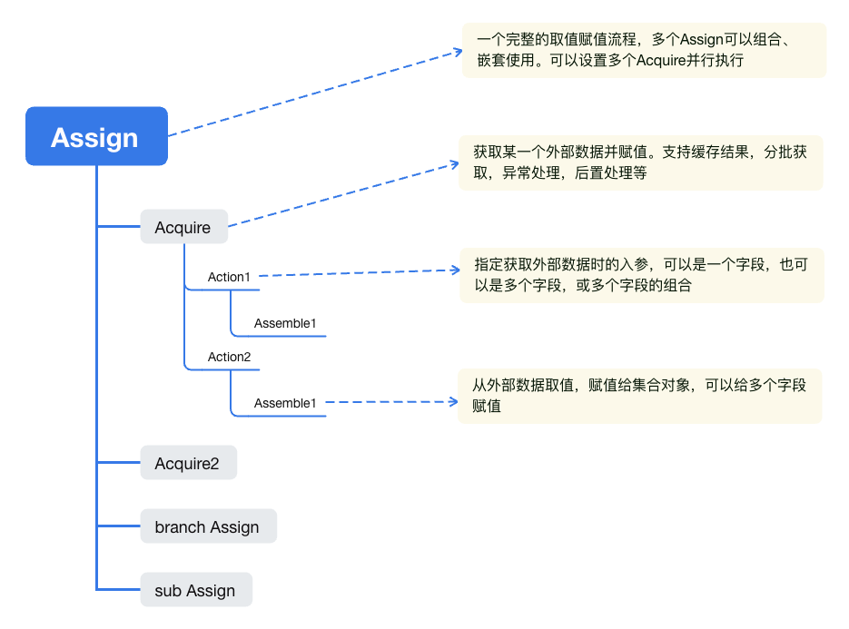

## 一、告别重复劳动：批量赋值的烦恼

在日常开发中，几乎每个Java开发者都遇到过这样的场景：需要根据某个字段的值批量查询关联数据并赋值。比如通过员工代码查询员工名称，通过网点代码查询网点名称等。

### 传统方式的痛点

看看这段熟悉的代码：

```java
public void assignNormal() {
    // 订单对象中字段：empCode，通常在前端页面展示的时候需要显示用户名称，这里批量给 empName 赋值
    Collection<OrderDTO> orderList = new ArrayList<>();
    if (CollectionUtils.isEmpty(orderList)) {
        return;
    }
    // 获取empCodes，过滤非空
    Set<String> empCodes = orderList.stream().map(OrderDTO::getEmpCode).filter(StringUtils::hasText).collect(Collectors.toSet());
    if (CollectionUtils.isEmpty(empCodes)) {
        return;
    }
    // 根据empCodes批量查询员工信息
    Collection<EmployeeDTO> employeeList;
    try {
        employeeList = findEmployeesByEmpCodes(empCodes);
    } catch (Exception e) {
        // 异常处理
        log.error("查询员工信息异常", e);
        throw new RuntimeException("查询员工信息异常", e);
    }
    // 以empCode为唯一Key转换为Map
    Map<String, EmployeeDTO> empCodeMap = employeeList.stream()
            .collect(Collectors.toMap(EmployeeDTO::getEmpCode, Function.identity(), (v1, v2) -> v1));
    // 循环处理orderList，给 empName 赋值
    orderList.forEach(order -> {
        String empCode = order.getEmpCode();
        if (Objects.isNull(empCode)) {
            return;
        }
        EmployeeDTO employeeDTO = empCodeMap.get(empCode);
        if (Objects.nonNull(employeeDTO)) {
            order.setEmpName(employeeDTO.getEmpName());
        }
    });
}
```

这种代码有什么问题？**重复、冗长、易错**！而且当需求变得复杂时，比如：

- 先通过empCode获取网点netCode，再通过网点netCode获取网点名称
- 同时获取员工、网点、物料等多类数据，需要多线程优化
- 需要空值处理、分批处理、异常处理等

代码会迅速膨胀，难以维护。这正是我们要解决的痛点

## 二、Assign组件：批量赋值的终极解决方案

### 什么是Assign组件？

Assign组件是一个专为Java开发者设计的批量赋值工具包，致力于让Java代码更简洁、优雅。
**核心优势**
相比传统方式，Assign组件具有以下显著优势：

- **标准化流程** - 统一取值赋值标准写法，提高开发效率
- **代码简洁** - 专注业务逻辑，减少模板代码
- **安全可靠** - 自动处理空指针、重复键等常见异常
- **高性能** - 支持多线程并行处理，支持本地缓存，提升性能
- **分批处理** - 智能分批，避免内存溢出和超时问题
- **灵活异常处理** - 支持多种中断策略，适应不同场景
- **自由组合** - 支持多个Assign组合，实现数据分类处理等多种复杂逻辑

### 架构图



## 三、快速上手

### 添加依赖

```xml

<dependency>
    <groupId>io.github.dao1230source</groupId>
    <artifactId>utility</artifactId>
    <version>latest version</version>
</dependency>
```

### 基础使用

将前面20多行的传统代码简化为：

```java
public void assign() {
    // 订单对象中字段：empCode，通常在前端页面展示的时候需要显示用户名称，这里批量给 empName 赋值
    Collection<OrderDTO> orderList = new ArrayList<>();
    // 创建一个Assign
    Assign.build(orderList)
            // Acquire：获取外部数据
            .addAcquire(this::findEmployeesByEmpCodes, EmployeeDTO::getEmpCode)
            // Action：指定字段取值
            .addAction(OrderDTO::getEmpCode)
            // Assemble：赋值
            .addAssemble(EmployeeDTO::getEmpName, OrderDTO::setEmpName)
            // 返回Assign并执行
            .backAcquire().backAssign().invoke();
}
```

代码量减少60%+，可读性大幅提升！

## 四、核心功能详解

### 1. 标准化赋值流程

Assign组件将复杂的赋值操作抽象为三个核心步骤：

```java
public void assign() {
    Assign.build(数据源)                                            // 构建
            .addAcquire(外部数据获取)                                // 获取外部数据
            .addAction(取值赋值操作)                                 // 指定取值字段
            .addAssemble(赋值操作)                                  // 执行赋值
            .backAcquire().backAssign().invoke();                  // 执行
}
```

### 2. 多线程并行处理

```java
public void parallel() {
    // 启用线程池，使用默认线程池 Assign.DEFAULT_EXECUTOR
    Assign.parallel();
    // 也可以自定义线程池
    ExecutorService executor = new ThreadPoolExecutor(10, 10, 0L, TimeUnit.MILLISECONDS, new SynchronousQueue<>());
    Assign.parallel(executor);
}
```

### 3. 分批处理

```java
public void batch() {
    Assign.build(orderList)
            .addAcquire(this::findEmployeesByEmpCodes, EmployeeDTO::getEmpCode)
            // 分批获取数据
            .batchSize(100);
}
```

接口的请求数据量过大，可能会导致以下问题：

- 服务加载数据过多，导致OOM等内存异常
- 接口耗时长或超时

不能充分利用微服务集群优势，此时可以分批获取数据

### 4. 灵活异常处理

提供多种中断策略，适应不同业务场景：

```java
public void interrupt() {
    // 发生异常时是否结束流程
    // InterruptStrategyEnum.ANY acquires 任一失败都结束
    assign.interruptStrategy(InterruptStrategyEnum.ANY);
}
```

支持策略：

- NO- 无论成功失败都不中断
- ANY- 任一失败就中断
- ALL- 全部失败才中断

### 5. 数据缓存支持

集成Caffeine缓存，避免重复查询：

```java
public void cache() {
    Assign.build(orderList)
            .addAcquire(this::findEmployeesByEmpCodes, EmployeeDTO::getEmpCode)
            // 缓存必须指定名称
            .name("fetch empName by empCode")
            // 启用缓存
            .cache()
            // 或自定义缓存
            .cache(() -> Caffeine.newBuilder().expireAfterAccess(600, TimeUnit.SECONDS).build());
}

```

### 6. 复杂依赖关系

轻松处理多层数据依赖：

```java
public void complexDependency() {
    Assign.build(orderList)
            .addAcquire(this::findEmployeesByEmpCodes, EmployeeDTO::getEmpCode)
            .addAction(OrderDTO::getEmpCode)
            .addAssemble(EmployeeDTO::getEmpName, OrderDTO::setEmpName)
            // 先获取员工的 netCode
            .addAssemble(EmployeeDTO::getNetCode, OrderDTO::setNetCode)
            // 如果有依赖关系，需要先执行当前的 Assign，以便后续的 Assign 执行时获取依赖数据
            .backAcquire().backAssign().invoke()
            // 再通过 netCode 获取网点数据
            .addAcquire(this::findNetByNetCodes, NetDTO::getNetCode)
            .addAction(OrderDTO::getNetCode)
            .addAssemble(NetDTO::getNetName, OrderDTO::setNetName)
            .backAcquire().backAssign().invoke();
}
```

### 多字段取值合并

```java
public void action() {
    // 同时获取创建人姓名和更新人姓名
    Assign.build(orderList)
            .addAcquire(this::findEmployeesByEmpCodes, EmployeeDTO::getEmpCode)
            // 获取创建人姓名
            .addAction(OrderDTO::getCreateUser)
            .addAssemble(EmployeeDTO::getEmpName, OrderDTO::setCreateUsername)
            .backAcquire()
            // 获取更新人姓名
            .addAction(OrderDTO::getUpdateUser)
            .addAssemble(EmployeeDTO::getEmpName, OrderDTO::setUpdateUsername)
            .backAcquire().backAssign().invoke();
}
```

### 赋值给多个字段

从外部数据取值，赋值给集合对象，可以给多个字段赋值

```java
public void assemble() {
    Assign.build(orderList)
            .addAcquire(this::findEmployeesByEmpCodes, EmployeeDTO::getEmpCode)
            .addAction(OrderDTO::getCreateUser)
            // 同时给 创建人姓名、在职状态赋值
            .addAssemble(EmployeeDTO::getEmpName, OrderDTO::setCreateUsername)
            .addAssemble(EmployeeDTO::isOnTheJob, OrderDTO::setOnTheJob)
            // 也可以自定义处理逻辑
            .addAssemble((orderDTO, employeeDTO) -> {
                orderDTO.setCreateUsername(employeeDTO.getEmpName());
                orderDTO.setOnTheJob(employeeDTO.isOnTheJob());
            });
}
```

## 五、高级特性

### 条件分支处理：

```java
public void branch() {
    // 添加分支
    Assign.build(orderList)
            // 只获取empCode为ta开头的订单
            .addBranch(k -> k.getEmpCode().startsWith("ta"))
            .addAcquire(this::findEmployeesByEmpCodes, EmployeeDTO::getEmpCode)
            .addAction(OrderDTO::getEmpCode)
            .addAssemble(EmployeeDTO::getEmpName, OrderDTO::setEmpName)
            .backAcquire().backAssign()
            // 返回最高层级
            .backSuperlative()
            .invoke();
}
```

### 后置处理

```java
public void afterProcessor() {
    Assign.build(orderList)
            .addAcquire(this::findEmployeesByEmpCodes, EmployeeDTO::getEmpCode)
            .afterProcessor((orderDTO, stringEmployeeMap) -> {
                //  处理完正常的赋值流程，异常处理流程后，执行后置逻辑
                //  比如员工必须有 网点 属性，否则报错
            });
}
```

### 支持自定义异常处理

```java
public void exceptionHandler() {
    Assign.build(orderList)
            .addAcquire(this::findEmployeesByEmpCodes, EmployeeDTO::getEmpCode)
            // 设置抛出异常，默认 Acquire 不抛出异常
            .throwException()
            .exceptionHandler((orderDTO, throwable) -> {
                //  如果 acquire fetcher 发生异常，在此处处理
            });
}
```

## 六、实际应用场景

场景1：订单查询

```java
public void orderQuery() {
    Assign.build(orderList)
            .addAcquire(this::findEmployeesByEmpCodes, EmployeeDTO::getEmpCode)
            .addAction(OrderDTO::getEmpCode)
            .addAssemble(EmployeeDTO::getEmpName, OrderDTO::setEmpName)
            // 获取员工的 netCode
            .addAssemble(EmployeeDTO::getNetCode, OrderDTO::setNetCode)
            // 如果有依赖关系，需要先执行当前的 Assign，以便后续的 Assign 执行时获取依赖数据
            .backAcquire().backAssign().invoke()
            // 获取网点数据
            .addAcquire(this::findNetByNetCodes, NetDTO::getNetCode)
            .addAction(OrderDTO::getNetCode)
            .addAssemble(NetDTO::getNetName, OrderDTO::setNetName)
            .backAcquire().backAssign()
            // 获取商品数据
            .addAcquire(this::findSupplyBySupplyCodes, SupplyDTO::getSupplyCode)
            .addAction(OrderDTO::getSupplyCode)
            .addAssemble(SupplyDTO::getSupplyName, OrderDTO::setSupplyName)
            .backAcquire().backAssign()
            .invoke();
}
```

场景2：导入校验

```java

public void importValidate() {
    Assign.build(successList)
            .name("落地配需求导入校验")
            // 指定线程池并行处理
            .parallel(ThreadPool.LANDING_MATCH_DEMAND)
            .addAcquireByList(ks -> ClientUtils.execute(() -> employeeApi.listByEmpCodes(ks)), EmployeeDTOType.Response::getEmpCode)
            .name("获取用户数据")
            .addAction(LandingMatchDemandImportDTO::getUserCode)
            // 员工有效数据过滤：必须在职
            .filter(k -> HireStatusEnum.ON_THE_JOB.getType() == k.getHireStatus())
            .addAssemble(EmployeeDTOType.Response::getEmpName, LandingMatchDemandImportDTO::setUserName)
            .backAcquire()
            .afterProcessor((dto, empCodeMap) -> {
                EmployeeDTOType.Response employee = empCodeMap.get(dto.getUserCode());
                if (Objects.isNull(employee)) {
                    log.error("用户数据不存在:{}", dto.getUserCode());
                    // 其他处理逻辑
                }
            })
            .backAssign()
            .addAcquire(ks -> ClientUtils.execute(() -> warehouseApi.findByWarehouseCodes(ks)), WarehouseDTO::getWarehouseCode)
            .name("获取仓库数据")
            .addAction(LandingMatchDemandImportDTO::getWarehouseCode)
            .addAssemble(WarehouseDTO::getWarehouseName, LandingMatchDemandImportDTO::setWarehouseName)
            .backAcquire()
            .afterProcessor((dto, warehouseCodeMap) -> {
                WarehouseDTO warehouse = warehouseCodeMap.get(dto.getWarehouseCode());
                if (Objects.isNull(warehouse)) {
                    log.error("仓库数据不存在:{}", dto.getWarehouseCode());
                }
            })
            .backAssign()
            .name("获取物料数据")
            .addAcquire(ks -> ClientUtils.execute(() -> supplyApi.listBySupplyCodes(ks)), SupplyResponseDTO::getSupplyCode)
            .addAction(LandingMatchDemandImportDTO::getMaterialCode)
            .addAssemble(SupplyResponseDTO::getSupplyName, LandingMatchDemandImportDTO::setMaterialName)
            .backAcquire()
            .afterProcessor((dto, supplyCodeMap) -> {
                SupplyResponseDTO supply = supplyCodeMap.get(dto.getMaterialCode());
                if (Objects.isNull(supply)) {
                    log.error("物料数据不存在:{}", dto.getMaterialCode());
                }
            })
            .backAssign()
            .invoke();
}
```

场景3：一个主表，多个子表的订单查询

库表结构：   
text_order 主表

- text_service_order_item 子表1
- text_rent_order_item 子表2

```java
public void queryOrders() {
    // 先查询订单主表数据
    List<TextOrderDTO<TextOrderItemDTO>> orders = new ArrayList<>();
    // 查询订单子表数据
    Assign.build(orders).parallel().addBranches(TextOrderDTO::getOrderType, TextOrderHandler.typeAssigners()).invoke();
}

/**
 * 订单类型枚举，管理订单类型和子表Handler的关系
 */
@Getter
@AllArgsConstructor
public enum TextOrderTypeEnum {
    PRO_SERVICE(10, "服务-专业服务", TextServiceOrderHandler.class),
    SERVICE(11, "服务-非专业服务", TextServiceOrderHandler.class),
    ;
    private final Integer type;
    private final String desc;
    /**
     * 订单前缀
     */
    private final Class<? extends TextOrderHandler<? extends TextOrderItemDTO>> validHandler;

    private static final Map<TextOrderTypeEnum, TextOrderHandler<? extends TextOrderItemDTO>> ORDER_TYPE_HANDLERS = new ConcurrentHashMap<>(16);

    public static void initHandler() {
        if (ORDER_TYPE_HANDLERS.isEmpty()) {
            for (TextOrderTypeEnum orderType : TextOrderTypeEnum.values()) {
                ORDER_TYPE_HANDLERS.put(orderType, SpringUtils.getBean(orderType.getValidHandler()));
            }
        }
    }

    @SuppressWarnings("unchecked")
    public static <E extends TextOrderItemDTO> TextOrderHandler<E> getHandler(TextOrderTypeEnum type) {
        initHandler();
        return (TextOrderHandler<E>) ORDER_TYPE_HANDLERS.get(type);
    }
}

/**
 * 订单处理接口
 * @param <E>
 */
public interface TextOrderHandler<E extends TextOrderItemDTO> {
    /**
     * 根据 orderIds 查询子表数据
     * @param orderIds orderIds
     * @return 具体对应的子表数据
     */
    List<E> selectItemByOrderIds(Collection<String> orderIds);

    /**
     * 查询各订单类型的明细数据
     *
     * @return func
     */
    default Function<Collection<TextOrderDTO<E>>, Assign<TextOrderDTO<E>>> assigner() {
        return orders -> Assign.build(orders)
                .<String, List<E>>addAcquire(orderIds -> {
                    List<E> items = this.selectItemByOrderIds(orderIds);
                    if (CollectionUtils.isEmpty(items)) {
                        return Map.of();
                    }
                    return items.stream().collect(Collectors.groupingBy(TextOrderItemDTO::getOrderId, Collectors.toList()));
                })
                .addAction(TextOrderDTO::getOrderId)
                .addAssemble(TextOrderDTO::setItems)
                .backAcquire().backAssign();
    }

    static Map<Integer, Function<Collection<TextOrderDTO<TextOrderItemDTO>>, Assign<TextOrderDTO<TextOrderItemDTO>>>> typeAssigners() {
        Map<Integer, Function<Collection<TextOrderDTO<TextOrderItemDTO>>, Assign<TextOrderDTO<TextOrderItemDTO>>>> keyAssigners = new HashMap<>();
        for (TextOrderTypeEnum type : TextOrderTypeEnum.values()) {
            Function<Collection<TextOrderDTO<TextOrderItemDTO>>, Assign<TextOrderDTO<TextOrderItemDTO>>> assigner = TextOrderTypeEnum.getHandler(type).assigner();
            keyAssigners.put(type.getType(), assigner);
        }
        return keyAssigners;
    }
}

/**
 *
 */
public class TextServiceOrderHandler implements TextOrderHandler<TextServiceOrderItemDTO> {
    @Override
    public List<TextServiceOrderItemDTO> selectItemByOrderIds(Collection<String> orderIds) {
        return List.of();
    }
}

/**
 * 主表DTO
 * @param <E>
 */
@Data
public class TextOrderDTO<E extends TextOrderItemDTO> {
    private String orderId;
    private Integer orderType;
    private List<E> items;
}

@Data
public class TextOrderItemDTO {
    private String orderId;
    private String itemId;
}

/**
 * 子表DTO
 */
public class TextServiceOrderItemDTO extends TextOrderItemDTO {
}

```

## 七、为什么选择Assign组件？

1. **提升开发效率**
   传统方式需要20+行的代码，使用Assign后只需5-6行，**开发效率提升70%以上**。
2. **减少bug发生率**
   自动处理空指针、异常处理等常见问题，**降低80%的相关bug**。
3. **性能优化**
   支持多线程、分批处理、数据缓存等特性，**大数据量处理性能提升50%+**。
4. **代码可维护性**
   统一标准的代码风格，使业务逻辑更清晰，**大幅提升代码可读性和可维护性**。

## 八、总结

Assign组件解决了Java开发中常见的批量赋值痛点，让开发者从繁琐的模板代码中解脱出来，专注于真正的业务逻辑。   
无论是简单的单字段赋值，还是复杂的多级依赖关系，Assign组件都能提供简洁、优雅的解决方案。
它的设计理念与现代Java开发的最佳实践高度契合，特别是充分利用了Java 8的Lambda表达式和函数式编程特性，让代码更符合声明式编程的优雅风格。   
**立即体验Assign组件，告别重复劳动，让你的Java代码变得更简单！**